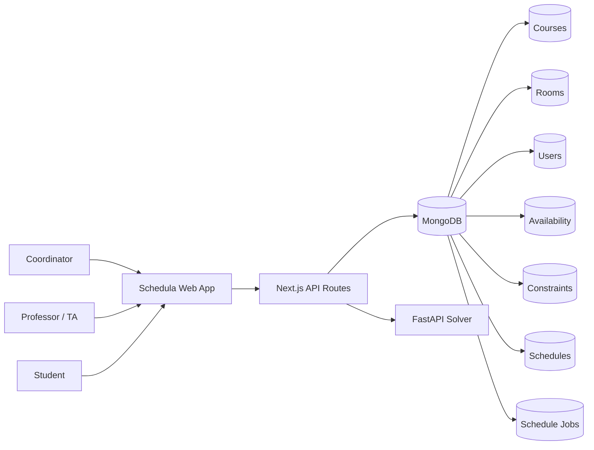
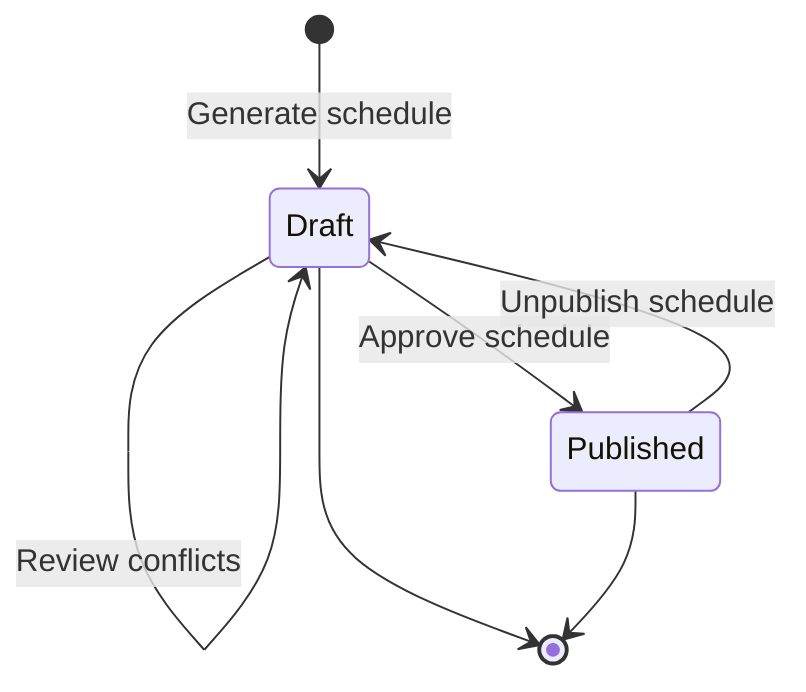
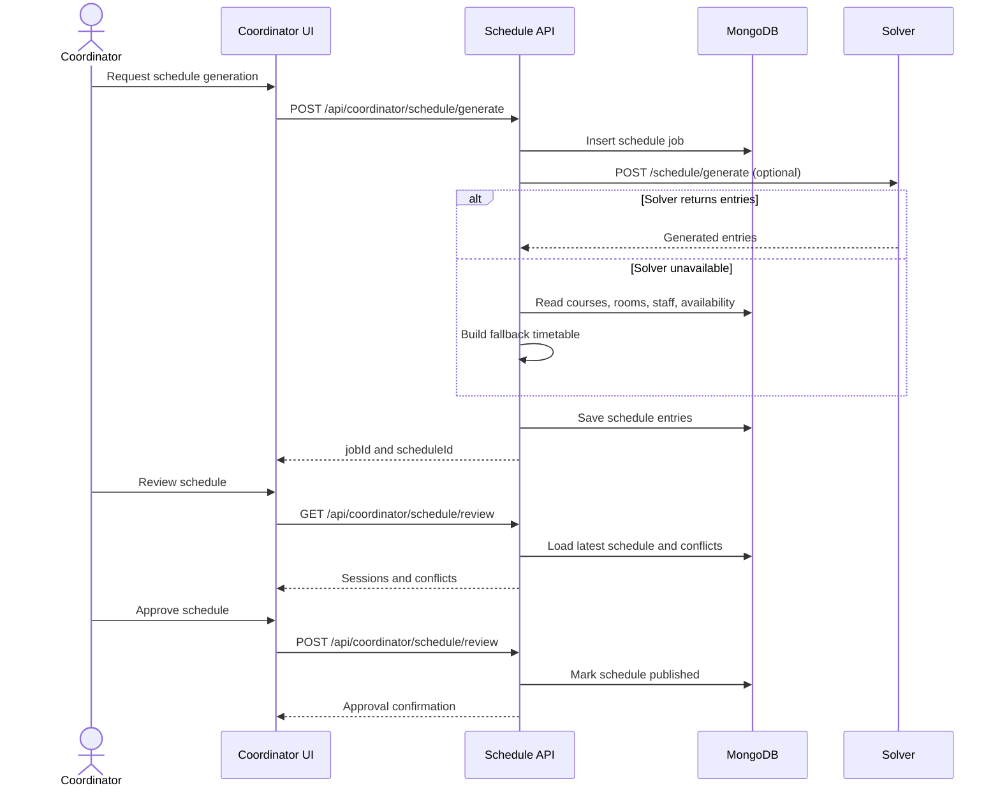

# Schedula Formal Software Specification

Version: 1.0
Date: 2026-04-19

## 1. Purpose

This document provides a formal software specification for Schedula, the university scheduling system in this repository. It defines the required behaviour of the system, the main system diagrams, an abstract VDM-SL model, and a set of validation test cases.

The specification is written against the current implementation shape of the product:

- Coordinator-driven schedule generation, review, approval, and publication
- Staff availability submission
- Student and staff schedule views
- Institution, course, room, and constraint management

## 2. System Scope

Schedula manages institutional timetable data for one or more academic terms. The system must support the following actors:

- Coordinator: configures data, runs schedule generation, reviews conflicts, approves or unpublishes schedules
- Professor / TA: submits weekly availability and views assigned teaching sessions
- Student: views the published timetable for their year level and term

The system boundaries include the Next.js application, its API routes, and the MongoDB-backed domain model used by those routes.

## 3. Requirements

### 3.1 Functional Requirements

FR-1. Authentication and role-based access
- The system shall authenticate users before allowing access to protected coordinator, staff, and student functions.
- The system shall enforce role-specific access rules so that users can only see operations allowed for their role.

FR-2. Institution setup
- The system shall store institution identity and active-term settings.
- The system shall expose the active working days and timetable configuration used by generation and review.

FR-3. Course management
- The system shall store courses with code, name, credit hours, and one or more sections.
- Each section shall record type, year levels, slot requirements, capacity, required room label, and assigned staff.

FR-4. Room management
- The system shall store rooms with label, name, building, and capacity.
- The system shall allow the coordinator to filter and inspect rooms used by the scheduler.

FR-5. Staff availability
- The system shall allow professors and TAs to submit weekly availability slots.
- The system shall validate submitted slots against allowed days and allowed times.
- The system shall persist the current term availability per staff member.

FR-6. Scheduling constraints
- The system shall support hard constraints that must never be violated.
- The system shall support soft constraints that influence the quality of the generated timetable.
- The system shall persist the current constraint configuration for the institution.

FR-7. Schedule generation
- The system shall generate a draft schedule from courses, staff, rooms, availability, and constraints.
- The system shall create a schedule job record when generation starts.
- The system shall support a solver-backed generation path and a fallback generation path.
- The system shall store generated entries against the current term.

FR-8. Schedule review
- The system shall compute conflicts for the latest generated schedule.
- The system shall present the sessions and conflict list to the coordinator.
- The system shall allow the coordinator to dismiss conflicts from the review view.

FR-9. Approval and publication
- The system shall allow the coordinator to approve a draft schedule.
- The system shall mark an approved schedule as published and store approval metadata.
- The system shall allow the coordinator to unpublish a schedule.

FR-10. Role-specific schedule views
- The system shall provide staff with a teaching schedule view.
- The system shall provide students with a timetable view filtered to the active term and the student’s year level.
- The system shall return a published schedule first and fall back to a draft schedule in development scenarios.

FR-11. Output and reporting
- The system shall allow timetable export or PDF generation from the client experience.
- The system shall display summary metrics for courses, staff, rooms, sessions, and conflicts.

### 3.2 Non-Functional Requirements

NFR-1. Integrity
- The system shall reject invalid identifiers, invalid slot values, and malformed schedule actions.

NFR-2. Performance
- The system shall return coordinator summary endpoints within a practical interactive threshold for typical institutional datasets.

NFR-3. Maintainability
- The schedule model, constraints, and API contracts shall remain traceable to explicit document sections and tests.

NFR-4. Usability
- The system shall present generation, review, and publication as separate, understandable steps.

NFR-5. Security
- The system shall not expose coordinator actions to staff or student roles.

## 4. Diagrams

### 4.1 System Context Diagram



### 4.2 Schedule Lifecycle Diagram



### 4.3 Generation and Approval Sequence



## 5. Data Model Summary

The abstract domain model used by the specification is:

- Institution: active term, working days, and scheduling settings
- Course: code, name, credit hours, and sections
- Section: type, year levels, slot demand, capacity, room requirement, and assigned staff
- Room: label, name, building, capacity
- Availability: staff, term, allowed weekly slots
- ConstraintSet: hard and soft scheduling rules
- Schedule: term, entries, publication status, approval metadata
- ScheduleJob: generation job status and progress information

## 6. VDM-SL Abstract Specification

The following VDM-SL model captures the core state and operations at an abstract level. It is intentionally smaller than the implementation and focuses on the business rules that must always hold.

```vdmsl
module SchedulaSpec

types

  Day = <Saturday> | <Sunday> | <Monday> | <Tuesday> | <Wednesday> | <Thursday>;
  Role = <Coordinator> | <Professor> | <TA> | <Student>;
  SessionType = <Lecture> | <Tutorial> | <Lab>;
  ScheduleStatus = <Draft> | <Published>;

  Minutes = nat;

  TimeSlot ::
    day      : Day
    startMin : Minutes
    lengthMin: nat1
  inv mk_TimeSlot(day, startMin, lengthMin) ==
    startMin < 24 * 60 and startMin + lengthMin <= 24 * 60;

  Section ::
    sectionId          : seq of char
    stype              : SessionType
    yearLevels         : set of nat1
    slotsPerWeek       : nat1
    slotDurationMin    : nat1
    capacity           : nat1
    requiredRoomLabel  : seq of char
    assignedStaff      : set of seq of char;

  Course ::
    code        : seq of char
    name        : seq of char
    creditHours : nat1
    sections    : set of Section;

  AvailabilitySlot ::
    day  : Day
    hour : nat1
  inv mk_AvailabilitySlot(day, hour) == hour <= 23;

  Availability ::
    staffId : seq of char
    slots   : set of AvailabilitySlot;

  Room ::
    roomId   : seq of char
    label    : seq of char
    capacity : nat1;

  ScheduleEntry ::
    courseCode : seq of char
    sectionId  : seq of char
    day        : Day
    startMin   : Minutes
    lengthMin  : nat1
    roomId     : seq of char
    staffId    : seq of char;

  Schedule ::
    termLabel : seq of char
    status    : ScheduleStatus
    entries   : set of ScheduleEntry;

  ConstraintSet ::
    noRoomOverlap      : bool
    noStaffOverlap     : bool
    respectAvailability: bool
    roomCapacity       : bool
    workingDaysOnly    : bool;

state SchedulaState of
  courses          : map seq of char to Course
  rooms            : map seq of char to Room
  availability     : map seq of char to Availability
  constraints      : ConstraintSet
  draftSchedule    : [Schedule]
  publishedSchedule : [Schedule]
inv mk_SchedulaState(courses, rooms, availability, constraints, draftSchedule, publishedSchedule) ==
  (draftSchedule = nil or draftSchedule.status = <Draft>) and
  (publishedSchedule = nil or publishedSchedule.status = <Published>);

functions

  Overlap : ScheduleEntry * ScheduleEntry -> bool
  Overlap(a, b) ==
    a.day = b.day and
    not (a.startMin + a.lengthMin <= b.startMin or b.startMin + b.lengthMin <= a.startMin);

  RoomConflict : set of ScheduleEntry -> bool
  RoomConflict(es) ==
    exists a, b in set es & a <> b and a.roomId = b.roomId and Overlap(a, b);

  StaffConflict : set of ScheduleEntry -> bool
  StaffConflict(es) ==
    exists a, b in set es & a <> b and a.staffId = b.staffId and Overlap(a, b);

  FitsAvailability : ScheduleEntry * Availability -> bool
  FitsAvailability(e, a) ==
    exists s in set a.slots & s.day = e.day and s.hour * 60 <= e.startMin;

operations

  SubmitAvailability : seq of char * set of AvailabilitySlot ==> ()
  SubmitAvailability(staffId, slots) ==
    availability := availability ++ { staffId |-> mk_Availability(staffId, slots) };

  GenerateSchedule : seq of char ==> ()
  GenerateSchedule(termLabel) ==
  ext rd courses, rooms, availability, constraints
      wr draftSchedule
  pre courses <> {} and rooms <> {}
  post draftSchedule <> nil and draftSchedule.status = <Draft>;

  ApproveSchedule : () ==> ()
  ApproveSchedule() ==
  ext wr draftSchedule, publishedSchedule
  pre draftSchedule <> nil
  post publishedSchedule <> nil and publishedSchedule.status = <Published>;

  UnpublishSchedule : () ==> ()
  UnpublishSchedule() ==
  ext wr publishedSchedule
  pre publishedSchedule <> nil
  post publishedSchedule = nil;

end SchedulaSpec
```

### 6.1 Interpretation Notes

- The VDM-SL model treats schedule generation as an abstract operation that must not create room or staff conflicts when the corresponding hard constraints are enabled.
- Availability is modelled conservatively as a set of allowed weekly slots.
- The implementation may use a solver or a fallback heuristic, but the observable result must satisfy the same requirements.

## 7. Validation Test Cases

The table below defines specification-level test cases. These are suitable as acceptance tests or as a basis for automated API tests.

| Test ID | Requirement | Input / Setup | Expected Result |
| --- | --- | --- | --- |
| TC-01 | FR-1 | Unauthenticated user requests a coordinator route | Request is denied with an authorization failure |
| TC-02 | FR-3 | Coordinator stores a course with two sections and assigned staff | Course is persisted and section count is reflected in summary output |
| TC-03 | FR-5 | Staff submits availability with valid day and hour values | Availability is saved and submission status becomes true |
| TC-04 | FR-5 | Staff submits availability containing invalid day or hour values | Invalid slots are ignored and only valid slots are stored |
| TC-05 | FR-6 | Coordinator saves hard and soft constraint settings | Constraint document is updated and later used by generation |
| TC-06 | FR-7 | Coordinator starts schedule generation with course, room, staff, and availability data present | A schedule job is created and a draft schedule is returned or stored |
| TC-07 | FR-8 | Coordinator opens review after generation with a known room or staff clash | Conflicts are reported and the review stats show unresolved items |
| TC-08 | FR-9 | Coordinator approves a draft schedule | The schedule becomes published and publish metadata is recorded |
| TC-09 | FR-9 | Coordinator unpublishes a schedule with a valid schedule ID | The schedule is marked unpublished |
| TC-10 | FR-10 | Student requests a timetable for a year level that matches section rules | Only matching sessions are returned in day-grouped output |
| TC-11 | FR-10 | Student requests a timetable before publication exists | The system returns an empty or fallback timetable with a clear message |
| TC-12 | FR-11 | Student or coordinator exports or prints the timetable | A printable representation is produced without altering saved data |

## 8. Traceability Matrix

| Requirement | Implemented By |
| --- | --- |
| FR-1 | Auth helpers, protected API routes, role checks |
| FR-3 | Course collections, coordinator course APIs |
| FR-5 | Staff availability route |
| FR-6 | Coordinator constraints route |
| FR-7 | Schedule generation route and job records |
| FR-8 | Review route and conflict detection |
| FR-9 | Review approval and published schedule routes |
| FR-10 | Student and staff schedule pages and APIs |
| FR-11 | Student PDF/print flow and dashboard summaries |

## 9. Acceptance Criteria

- Every generated schedule shall be traceable to a generation job record.
- Every published schedule shall have approval metadata.
- No student-facing schedule shall expose coordinator-only controls.
- Availability, room assignment, and staff assignment must remain internally consistent across review and publish flows.
